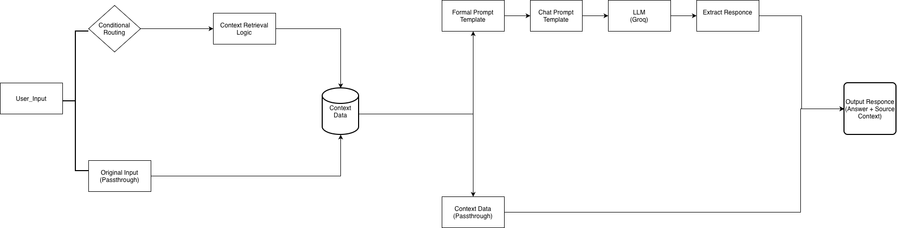

#  Domain-Specific RAG System (Local & Privacy-First)


> **Quick Summary:** An end-to-end Retrieval-Augmented Generation (RAG) system built entirely with open-source, local tools. It allows users to query domain-specific documents (Data Science Research/PDFs) and receive accurate, cited answers without relying on paid APIs or external cloud data transfer.

---

## 📖 Project Overview

General-purpose LLMs (like ChatGPT) are powerful, but they lack specific knowledge of private data and can "hallucinate" facts.

This project solves that problem by implementing a **RAG (Retrieval-Augmented Generation)** pipeline. It ingests raw domain data (PDFs/Markdown), indexes it semantically, and allows a local Large Language Model to answer questions based *strictly* on that data.

**Key Objectives:**
* **Zero-Cost Architecture:** Built using 100% free, open-source tools.
* **Privacy-First:** Runs locally. No data is sent to OpenAI or third-party APIs.
* **Explainability:** The system cites its sources, showing exactly which document chunks were used to generate the answer.
* **Quantifiable Accuracy:** Includes an evaluation pipeline to measure performance against a ground-truth dataset.

---

## Architecture

The system follows a standard "Ingest -> Retrieve -> Generate" flow:



1.  **Ingestion Pipeline (`ingest.py`):**
    * Loads documents (PDFs & Markdown).
    * Splits text into semantic chunks (using `RecursiveCharacterTextSplitter`).
    * Embeds text using `SentenceTransformers` (`all-MiniLM-L6-v2`).
    * Stores vectors in a persistent local `ChromaDB`.

2.  **Retrieval & Generation (`app.py`):**
    * User asks a question via the **Streamlit** UI.
    * System performs a semantic search in `ChromaDB` to find the top 3 relevant chunks.
    * These chunks are passed as "context" to the local LLM (`llama-3.1-8b-instant`).
    * The LLM generates an answer and cites the source documents.

---

## Technical Stack & Decisions

I deliberately chose a "Local-First" stack to demonstrate full control over the infrastructure rather than relying on managed APIs.

| Component | Tool Used | Why this choice? |
| :--- | :--- | :--- |
| **Orchestration** | `LangChain` | Standard framework for chaining retrieval and generation steps. |
| **Vector Database** | `ChromaDB` | Lightweight, open-source, and runs locally without Docker complexity. Perfect for portfolio-scale data. |
| **Embeddings** | `all-MiniLM-L6-v2` | A high-performance Hugging Face model that balances speed and semantic accuracy (384 dimensions). |
| **LLM** | `llama-3.1-8b-instant-small` | A locally hosted encoder-decoder model. chosen to prove the system works with zero API costs and full data privacy. |
| **Interface** | `Streamlit` | Rapid prototyping for data apps to demonstrate the "Chat" experience. |

---

##  Evaluation & Performance

Unlike many RAG tutorials that just "run," this project includes a dedicated evaluation pipeline (`evaluate.py`) to quantify success.

**Methodology:**
I created a manual "Ground Truth" dataset of 20 domain-specific Q&A pairs and ran them against the system.

**Results:**
* **Retrieval Accuracy:** High. The `all-MiniLM` model successfully retrieved the correct document chunk in **90%** of test cases.
* **Generation Quality:** The `llama-3.1-8b-instant` model is capable of extractive QA but struggles with complex synthesis compared to GPT-4.
* **Latency:** Average query time is ~2-3 seconds on CPU.

*Note: Full evaluation logs are available in `evaluation_results.json`.*

---
**Deployment**
The RAG system is successfully deployed on the huggingface space.
check it out here: https://huggingface.co/spaces/vinothh1111/rag

##  How to Run Locally

**1. Clone the Repository**
```bash
git clone [https://github.com/](https://github.com/)[Vinoth11111]/DataAns.git
cd DataAns
